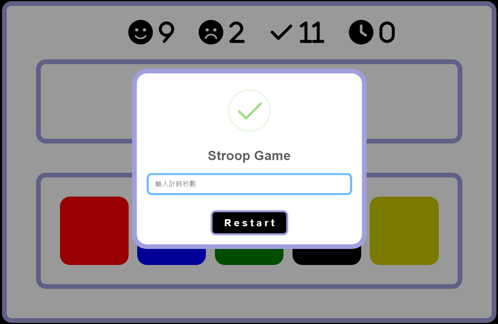

# Stroop Game
## 這是一個有關Stroop Effect的小遊戲，也可以稱此遊戲為Stroop Color and Word Test(SCWT)或Stroop Test
### 遊戲介紹:
1. 一開始會先需要輸入遊玩的時間也就是倒計時的時間。

    
2. 之後便開始遊玩，此遊戲需要遊玩者點擊文字顯示的顏色而非文字描述的顏色。

    

3. 遊戲結束上面應會顯示出三個數字分別代表
    - 笑臉為答對題數。
    - 哭臉為答錯題數。
    - 勾則為已作答數。

    

### 開始遊戲:
Web version : 
[Here](https://zykaiyz.github.io/Stroop-Game/stroop.html)

Python version :
```
> python stroop.py
```
